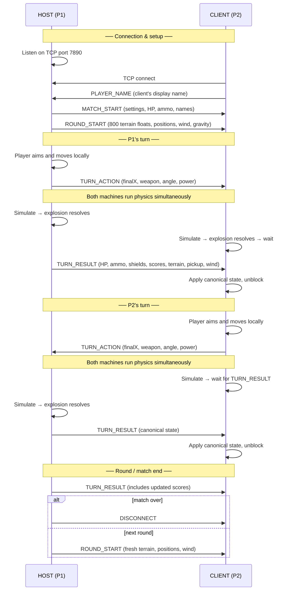

# TANX

A two-player, turn-based tank artillery game inspired by classic Amiga-era
games of the early 1990s (in particular *Tanx* by Gary Roberts, 1991).
Destructible terrain, wind and gravity, special weapons, map pickups, local
LAN multiplayer, and a fully wood-panelled retro HUD — built from scratch in
C++ on top of [olc::PixelGameEngine](https://github.com/OneLoneCoder/olcPixelGameEngine).

---

## Features

- **Local LAN multiplayer** — each player runs the game on their own machine;
  one hosts, the other joins by IP address. Both machines simulate the shot
  simultaneously the moment the action is sent, so there's no lag on a local
  network. Hotseat (both players, one keyboard) also fully supported.
- **Destructible, procedurally-generated terrain** — Mountains or Foothills,
  or randomised each round
- **Configurable wind & gravity** — None / Light / Medium / Strong / Random,
  set before each match from the menu
- **Configurable game settings** — adjust starting HP, movement budget, and
  starting ammo for every special weapon from the pre-match menu
- **Six special weapons** (ammo is scarce; all configurable from the menu):
  - **High Explosive** — double-radius blast
  - **Cluster** — splits into three shells at the apex of flight
  - **Laser** — instant beam that cuts a trench through the terrain
  - **Ballistics Computer** — calculates the exact angle/power needed for a
    direct hit (doesn't account for wind — that part's still on you)
  - **Shield** — three layers of protection that degrade visibly
    (thick blue → orange → red) from hits *and* from time, whichever comes first
- **Map pickups** — a Mystery box (random ammo) and a Health box (+1 HP)
  spawn one at a time. Drive over them to collect, or shoot them to deny
  your opponent. Health boxes only appear once a tank is on 1 HP.
- **Draw detection** — rounds end as a draw if both tanks die in the same
  explosion, or if 30 consecutive turns pass without a hit (stalemate)
- **Click or keyboard controls** — set angle/power/movement via on-screen
  buttons, keyboard keys, or by typing the value directly
- **Plunger fire button & white flag surrender** — in the style of the
  original Amiga HUD
- **Procedural sound** — every sound effect (explosion, shell whistle, plunger
  click) is synthesised at startup; no audio assets required

---

## Controls

| Action | Input |
|---|---|
| Adjust angle | `A` / `D`, click `−` / `+` buttons, or type `0–9` |
| Adjust power | `W` / `S`, click `−` / `+` buttons, or type `0–9` |
| Move tank | `←` / `→`, or click `[<]` / `[>]` buttons in the HUD |
| Select weapon | Click a weapon box in the bottom HUD row |
| Fire | `SPACE`, or click the plunger button |
| Skip turn | `ENTER` |
| Surrender | Click the white flag button |

---

## Local LAN multiplayer

Both machines must be on the same network (or the same machine for testing
via `127.0.0.1`). The game communicates over **TCP port 7890**.

1. **Host machine (Player 1):** open the menu → click **NETWORK** →
   **HOST GAME**. Your local IP address is displayed on screen.
2. **Client machine (Player 2):** open the menu → click **NETWORK** →
   **JOIN GAME** → type the host's IP → press Enter.
3. Once connected, the host's settings are sent to the client automatically
   and the match begins. Each player sees and controls only their own tank.

> **Firewall note (Windows):** if the connection fails, allow the game
> through Windows Defender Firewall for private networks, or temporarily
> disable the firewall for testing.

### How the network protocol works

The **Host** is always Player 1 and is authoritative — it runs the
simulation, resolves outcomes, and sends the canonical state to the Client
after every turn. The **Client** mirrors the simulation locally purely for
smooth animation; it snaps to the Host's values once `TURN_RESULT` arrives.

**Simultaneous fire:** when a player commits their shot, `TURN_ACTION` is
sent immediately (angle, power, weapon, final position). Both machines
start the physics simulation at the same moment, so the projectile flies on
both screens in real time with no perceived lag — even on a LAN with a few
milliseconds of delay.

**Terrain sync:** terrain is generated by the Host using `rand()`, which
produces different sequences on different platforms even with the same seed.
Rather than risk divergence, the Host sends all 800 height values (~3 KB)
to the Client at the start of every round and again inside every
`TURN_RESULT` after a crater is carved.

#### Message flow



#### Packet format

Every message on the wire is:

```
[1 byte: message type][3 bytes: payload length][N bytes: payload]
```

All multi-byte integers are big-endian (network byte order).

| Message | Direction | Key payload fields |
|---|---|---|
| `PLAYER_NAME` | Client → Host | Display name string |
| `MATCH_START` | Host → Client | All GameSettings fields |
| `ROUND_START` | Host → Client | 800 terrain floats, tank positions, wind, gravity |
| `TURN_ACTION` | Acting → Other | finalX, weapon, angle, power, skip/surrender flags |
| `TURN_RESULT` | Host → Client | HP, shields, ammo, scores, 800 terrain floats, pickup, wind |
| `DISCONNECT` | Either | *(empty)* |

---

## Building from source

TANX is a single C++ source file (`tanx.cpp`) plus two bundled single-header
libraries. The included `Makefile` auto-detects your platform — there is
nothing to install beyond a C++17 compiler and (on macOS/Linux) libpng.

### macOS

Requires Xcode Command Line Tools and [Homebrew](https://brew.sh) for libpng:

```sh
xcode-select --install
brew install libpng
make
./tanx
```

### Linux

Requires a C++17 compiler and X11/OpenGL/libpng development headers:

```sh
# Debian / Ubuntu
sudo apt install build-essential libx11-dev libgl1-mesa-dev libpng-dev

make
./tanx
```

### Windows

The easiest path is [MSYS2](https://www.msys2.org/) with the MinGW-w64
toolchain:

1. Download and install MSYS2 from https://www.msys2.org/
2. Open the **MSYS2 UCRT64** shell (find it in the Start menu)
3. Install the compiler and make:
   ```sh
   pacman -S mingw-w64-ucrt-x86_64-gcc make
   ```
4. Navigate to the project folder and build:
   ```sh
   make
   ./tanx.exe
   ```

> **Note:** make sure you open the **UCRT64** shell specifically — other MSYS2
> shells use different package names and may not find the compiler.

No libpng is needed on Windows — the engine uses the built-in GDI+ instead.

**Visual Studio / Code::Blocks alternative:** create a new C++ project, add
`tanx.cpp` as the only source file, set the C++ standard to C++17, and link
against:

```
user32  gdi32  opengl32  gdiplus  shlwapi  dwmapi  ws2_32
```

(`ws2_32` is required for the networking code on Windows.)

---

## Project structure

```
tanx.cpp                  Game source (single file)
olcPixelGameEngine.h      Graphics / windowing / input (third-party, bundled)
miniaudio.h               Cross-platform audio (third-party, bundled)
Makefile                  Cross-platform build file (macOS / Linux / Windows)
LICENSE                   License for this project's own code
THIRD_PARTY_LICENSES.md   Licence & attribution for the bundled libraries
```

---

## Credits

- Built on [olc::PixelGameEngine](https://github.com/OneLoneCoder/olcPixelGameEngine)
  by [OneLoneCoder.com](https://www.onelonecoder.com) (Javidx9)
- Audio powered by [miniaudio](https://miniaud.io) by David Reid
- Inspired by *Tanx* (1991) by Gary Roberts

See [THIRD_PARTY_LICENSES.md](THIRD_PARTY_LICENSES.md) for full licence
details on the bundled libraries.

---

## Licence

This project's own code is released under the OLC-3 licence — see
[LICENSE](LICENSE).
